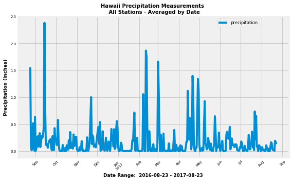
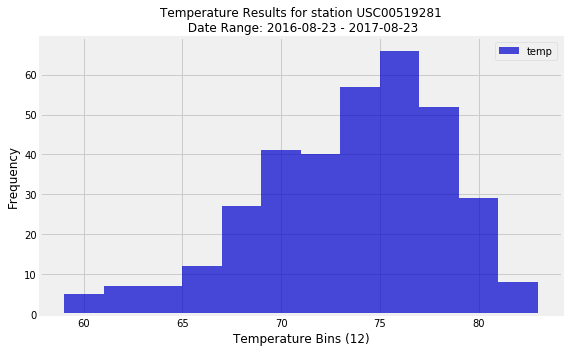
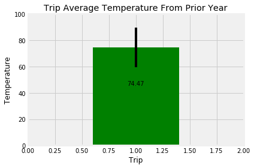
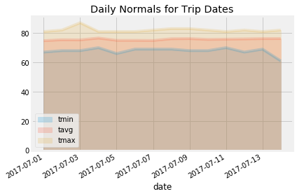

# Surfs Up!

## Step 1 - Climate Analysis and Exploration

```
%matplotlib inline
from matplotlib import style
import matplotlib.pyplot as plt
import matplotlib.style as style
style.use('fivethirtyeight')
```
```
import numpy as np
import pandas as pd
```
```
import datetime as dt
from datetime import datetime
```


## Reflect Tables into SQLAlchemy ORM
```
```
# Python SQL toolkit and Object Relational Mapper
```
import sqlalchemy
from sqlalchemy.ext.automap import automap_base
from sqlalchemy.orm import Session
from sqlalchemy import create_engine, func
from sqlalchemy import inspect
```
```
engine = create_engine("sqlite:///Resources/hawaii.sqlite")

```
# reflect an existing database into a new model

```
Base = automap_base()
```
```
# reflect the tables
```
```
Base.prepare(engine, reflect=True)
```
```
# View all of the classes that automap found
```
```
Base.classes.keys()
```
```
# Save references to each table
```
```
Measurement = Base.classes.measurement
Station = Base.classes.station

```
# Session (link) from Python to the DB

```
session = Session(engine)
```
```
inspector = inspect(engine)
inspector

```
# Rename Base to schema

```
schema = Base
schema.classes.items()

```
# Use inspector to view table details

```
for table_name in inspector.get_table_names():
    for column in inspector.get_columns(table_name):
        print( table_name,": ", column.get('name'), ", ", column.get('type'))

```
## Step 1 - Climate Analysis and Exploration
### Precipitation Analysis
```
```
# Calculate the date 1 year ago from today

```
most_recent_date = session.query(Measurement.date)\
    .order_by(Measurement.date.desc()).first()
most_recent_date

```
# Reduce most recent date of data collected, reduced by 1 year for query for 365 days

```
rec_date = str(most_recent_date)[2:-3]
year_ago = str(eval(rec_date[0:4])-1) + rec_date[4:]
year_ago

```
# View information from Measurement
# An average of the Station's precipitation measurment is used for this analysis as it made more analysis sense.
#   The original requirements were for querying precipitation amounts, without mention of average

```
test_precip_twelve = session.query(Measurement.date,
                                   func.avg(Measurement.prcp))\
    .filter(Measurement.date > year_ago)\
    .group_by(Measurement.date)\
    .order_by(Measurement.date).all()
    
for row in test_precip_twelve:
    print(row)
* Use Pandas to print the summary statistics for the precipitation data.

```
# Create dataframe in the rough and sort by date for graph

```
precip_df = pd.DataFrame(test_precip_twelve, columns=['date','prcp'])
precip_df['date'] = pd.to_datetime(precip_df['date'], format='%Y/%m/%d')
precip_df.sort_values(by=['date'])
precip_df.head()

```
# Reset index to Date and drop dates with no measurements taken for precipitation.
# This Dataframe is just for the graff of precipation amounts recorded.  

```
precip_df.set_index('date', inplace=True)
precip_df.dropna(inplace=True)
precip_df.head()

```
# Use Pandas Plotting with Matplotlib to plot the data

```
precip_df.plot(use_index=True, y='prcp', figsize=(8,5))
plt.gcf().subplots_adjust(bottom=0.15)
plt.title("Hawaii Precipitation Measurements \n All Stations - Averaged by Date", fontweight='bold',size=10)
plt.xlabel(f"Date Range:  {year_ago} - {rec_date}", fontweight='bold', size=9)
plt.ylabel("Precipitation (inches)", fontweight='bold', size=9)
plt.yticks(size=7)
plt.xticks(rotation=45, size=7)
plt.legend(["precipitation"],loc=1, fontsize='small', bbox_to_anchor=(.90, 1))
plt.tight_layout()
plt.savefig('precipitation_amounts.png')
plt.show()
```





# Use Pandas to calcualte the summary statistics for the precipitation data

```
precip_df.describe()

```

### Station Analysis

# Use inspector to view table details

```
for table_name in inspector.get_table_names():
    for column in inspector.get_columns(table_name):
        print( table_name,": ", column.get('name'), ", ", column.get('type'))

```
# How many stations are available in this dataset?

```
station_list = session.query(Station.id,Station.station,Station.name)
print(f"There are {station_list.count()} stations in the dataset")

```
# List the stations and the counts in descending order.

```
station_activity = session.query(Measurement.station,
                  func.count(Measurement.station))\
.group_by(Measurement.station)\
.order_by(func.count(Measurement.station).desc())
for row in station_activity:
    print(row)

```
# What are the most active stations? 

```
highest_station_activity = session.query(Measurement.station,
                  func.count(Measurement.station))\
.group_by(Measurement.station)\
.order_by(func.count(Measurement.station).desc()).limit(1).scalar()
print(f"The station with the hightest number of observations is {highest_station_activity}. ")

```
# Using the station id from the previous query, calculate the lowest temperature recorded, 
#    highest temperature recorded, and average temperature most active station?

```
q = session.query(Station.id,
                  Station.name,
                  func.min(Measurement.tobs),
                  func.max(Measurement.tobs),
                  func.avg(Measurement.tobs))\
.filter(Measurement.station == Station.station)\
.filter(Measurement.station == "USC00519281")
avg_tmp_rec = "{0:.1f}".format(q[0][4])
print(f"Most Active Station ID: {q[0][0]}, \
    Name: {highest_station_activity},\
    Location: {q[0][1]} \nResults: \n    Minimum temperature recorded:  {q[0][2]}\n\
    Maximum temperture recorded :  {q[0][3]}\n    Average temperature recorded:  {avg_tmp_rec}")

```
# Choose the station with the highest number of temperature observations = (highest_station_activity)
# Query the last 12 months of temperature observation data for this station and plot the results as a histogram

```
tobs_twelve = session.query(Measurement.tobs)\
    .filter(Measurement.date > year_ago)\
    .filter(Measurement.station == highest_station_activity)\
    .order_by(Measurement.tobs).all()
    
for row in tobs_twelve:
    print(row)
```
```
tobs_df = pd.DataFrame(tobs_twelve, columns=['temp'])
tobs_df.head()

```
# Histogram Plot for Temperature Results of the Most Active Station

```
plt.subplots(figsize=(8,5))

plt.hist(tobs_df['temp'], bins=12, color="mediumblue", alpha=.7)
plt.title(f"Temperature Results for station {highest_station_activity}\n Date Range: \
{year_ago} - {rec_date}",fontsize=12)
plt.xlabel('Temperature Bins (12)', fontsize=12)
plt.ylabel("Frequency", fontsize=12)
labels = ['temp']
plt.legend(labels)
plt.gcf().subplots_adjust(bottom=0.15)
plt.tight_layout()
plt.savefig('temperature_results_hist.png')
plt.show()

```



## Step 2 - Climate App

```
from flask import Flask, render_template, redirect, jsonify

```
```
dependencies
```
```
import sqlalchemy
from sqlalchemy.ext.automap import automap_base
from sqlalchemy.orm import Session
from sqlalchemy import create_engine
from sqlalchemy import func

import pandas as pd
import numpy as np
import datetime

app = Flask(__name__)
```
```
engine = create_engine("sqlite:///Resources/hawaii.sqlite?check_same_thread=False")
Base = automap_base()
Base.prepare(engine, reflect=True)
```
```
Measurements = Base.classes.measurement
Stations = Base.classes.station
session = Session(engine)
```
```
@app.route("/")
#List all available routes
def home ():
	return (
		f"Welcome to the Surfs Up<br>"
		f"Available Routes:<br>"
		f"/api/v1.0/precipitation<br>"
		f"/api/v1.0/stations<br>"
		f"/api/v1.0/tobs<br>"
		f"/api/v1.0/(start)<br>"
		f"/api/v1.0(start)/(end)"
	)
	
@app.route("/api/v1.0/precipitation")
def precipitation():
	#Query for the dates and temperature observations from the last year.
	results = session.query(Measurements.date,Measurements.prcp).filter(Measurements.date >= "08-23-2017").all()

	year_prcp = list(np.ravel(results))
	#results.___dict___
	#Create a dictionary using 'date' as the key and 'prcp' as the value.
	"""year_prcp = []
	for result in results:
		row = {}
		row[Measurements.date] = row[Measurements.prcp]
		year_prcp.append(row)"""

	return jsonify(year_prcp)

@app.route("/api/v1.0/stations")
def stations():
	#return a json list of stations from the dataset.
	results = session.query(Stations.station).all()

	all_stations = list(np.ravel(results))

	return jsonify(all_stations)

@app.route("/api/v1.0/tobs")
def temperature():
	#Return a json list of Temperature Observations (tobs) for the previous year
	year_tobs = []
	results = session.query(Measurements.tobs).filter(Measurements.date >= "08-23-2017").all()

	year_tobs = list(np.ravel(results))

	return jsonify(year_tobs)

@app.route("/api/v1.0/<start>")
def start_trip_temp(start):
	
	start_trip = []

	results_min = session.query(func.min(Measurements.tobs)).filter(Measurements.date == start).all()
	
	results_max = session.query(func.max(Measurements.tobs)).filter(Measurements.date == start).all()
	results_avg = session.query(func.avg(Measurements.tobs)).filter(Measurements.date == start).all()

	return jsonify(results_min,results_max, results_avg)

@app.route("/api/v1.0/<start>/<end>")

def start_end_trip(start, end):

	start_end_trip_temps = []

	results_min = session.query(func.min(Measurements.tobs)).filter(Measurements.date == start, Measurements.date == end).all()
	results_max = session.query(func.max(Measurements.tobs)).filter(Measurements.date == start, Measurements.date == end).all()
	results_avg = session.query(func.avg(Measurements.tobs)).filter(Measurements.date == start, Measurements.date == end).all()

	return jsonify(results_min,results_max, results_avg)

if __name__ == '__main__':
    app.run(debug=True)
```

### Temperature Analysis

# Write a function called `calc_temps` that will accept start date and end date in the format '%Y-%m-%d' 
# and return the minimum, average, and maximum temperatures for that range of dates

```
def calc_temps(start_date, end_date):
    """TMIN, TAVG, and TMAX for a list of dates.
    
    Args:
        start_date (string): A date string in the format %Y-%m-%d
        end_date (string): A date string in the format %Y-%m-%d
        
    Returns:
        TMIN, TAVE, and TMAX
    """
    
    return session.query(func.min(Measurement.tobs), func.avg(Measurement.tobs), func.max(Measurement.tobs)).\
        filter(Measurement.date >= start_date).filter(Measurement.date <= end_date).all()
temp_range = (calc_temps('2012-02-28', '2012-03-05'))
print(temp_range)

```
# calculate the min/max/avg from previous year

```
trip_arrive = dt.date(2018, 4, 1)
trip_leave = dt.date(2018, 4, 15)
last_year = dt.timedelta(days=365)
temp_avg_lst_year = (calc_temps((trip_arrive-last_year), (trip_leave-last_year)))
print(temp_avg_lst_year)
```
```
# plot the calculated min/max/avg from previous year as a bar chart
```
```
p2p = temp_avg_lst_year[0][2]-temp_avg_lst_year[0][0]
avgtemp = temp_avg_lst_year[0][1]
min_temp = temp_avg_lst_year[0][0]
max_temp = temp_avg_lst_year[0][2]

fig, ax = plt.subplots()
bar_chart = ax.bar(1 , avgtemp, color= 'green', yerr=p2p)
ax.set_xlabel("Trip")
ax.set_ylabel("Temperature")
ax.set_title("Trip Average Temperature From Prior Year")

def autolabels(rects):
    for rect in rects:
        h=rect.get_height()
        ax.text(rect.get_x() + rect.get_width()/2., .6*h,'%.2f' % float(h) ,ha='center', va='bottom', fontsize=10)

        
    # label the bars 
autolabels(bar_chart)        
plt.ylim(0, 100)
plt.xlim(0,2)
fig.tight_layout()
plt.show()

```


### Daily Rainfall Average.

# Calculate the rainfall per weather station for your trip dates using the previous year's matching dates.
# Sorted in descending order by precipitation amount and list the station, name, latitude, longitude, and elevation.

```
def precipitation(start_date, end_date):
    
        # Docstring for the function `calc_temps`
    """Precipitation information per weather station
    
    Args:
        start_date (string): A date string in the format %Y-%m-%d
        end_date (string): A date string in the format %Y-%m-%d
        
    Returns:
        A list of tuples containing precipitation amount, station, name, latitude, longitude, and elevation in descending order.
    """
    
    sel = [Measurement.station, 
           Station.name, 
           Station.latitude, 
           Station.longitude, 
           Station.elevation, 
           Measurement.prcp]
    
    return session.query(*sel).\
            filter(Measurement.station == Station.station).filter(Measurement.date >= start_date).filter(Measurement.date <= end_date).group_by(Measurement.station).order_by(Measurement.prcp.desc()).all()

print(precipitation('2017-07-01','2017-07-14'))

```
# Create a query that will calculate the daily normals 
# (i.e. the averages for tmin, tmax, and tavg for all historic data matching a specific month and day)

```
def daily_normals(date):
    """Daily Normals.
    
    Args:
        date (str): A date string in the format '%m-%d'
        
    Returns:
        A list of tuples containing the daily normals, tmin, tavg, and tmax
    
    """
    
    sel = [func.min(Measurement.tobs), func.avg(Measurement.tobs), func.max(Measurement.tobs)]
    return session.query(*sel).filter(func.strftime("%m-%d", Measurement.date) == date).all()
    
daily_normals("01-01")

```
# calculate the daily normals for the trip
# apply tuple of calculations into a list called `normals`

# Start and end date of the trip

```
start_date = '2017-07-01'
end_date ='2017-07-14'

```
# Start and end date to create a range of dates

```
dates = session.query(Measurement.date).filter(Measurement.date >= start_date).filter(Measurement.date <= end_date).group_by(Measurement.date).all()

```
# List to get elements in the tuple from the dates

```
trip_dates = [x[0] for x in dates]
```


# Save a list of %m-%d strings with another list comprehension 

```
trip_dates_stripped= [x[5:] for x in trip_dates]

```

# Start month/day and the end month/day 

```
start_month_day = trip_dates_stripped[0]
end_month_day = trip_dates_stripped[-1]

```

# Loop through the list of %m-%d strings and calculate the normals for each date

```
daily_normals = [session.query(func.min(Measurement.tobs),
                       func.avg(Measurement.tobs),
                       func.max(Measurement.tobs)).filter(func.strftime("%m-%d", Measurement.date) >= start_month_day).filter(func.strftime("%m-%d", Measurement.date) <= end_month_day).group_by(func.strftime("%m-%d", Measurement.date)).all()]

daily_normals = daily_normals[0]
print("Aggregate Daily Normals for 07-01 to 07-14")
daily_normals

```
# Load the previous query results into a Pandas DataFrame and add the `trip_dates` range as the `date` index
# Dataframe from the previous query 

```
daily_normals_df= pd.DataFrame(daily_normals,columns=['tmin', 'tavg', 'tmax'])

```
# Trip_dates added to Pandas DataFrame

```
daily_normals_df['date']= trip_dates

```
# Changed to datetime object on Pandas, makes x axis title to add 

```
daily_normals_df['date'] = pd.to_datetime(daily_normals_df['date'], format='%Y-%m-%d')

```
# Index to date

```
daily_normals_df.set_index('date',inplace=True)

daily_normals_df

```
# Plot the daily normals as an area plot with `stacked=False`

```
daily_normals_df.plot(kind='area', alpha=.2, stacked=False, x_compat=True, title="Daily Normals for Trip Dates")
plt.tight_layout()
plt.savefig("Images/DailyNormals.png")
plt.show()

```


